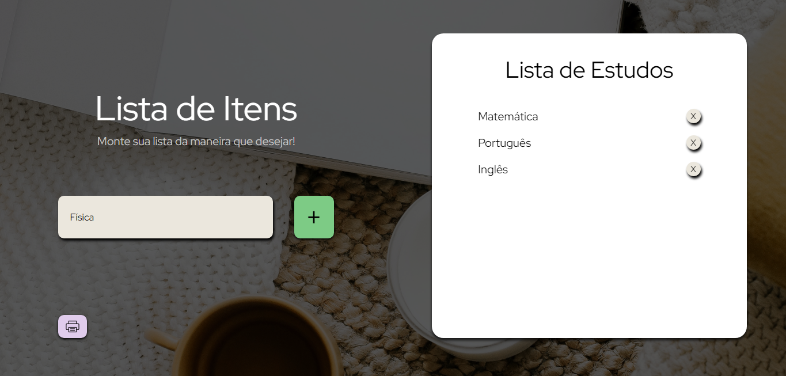
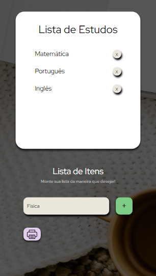

# 🔸 Lista de Itens
Neste projeto, o usuário poderá criar uma lista com os itens que desejar. Basta apenas inserir o nome no campo referenciado e clicar no botão "+" ou apenas pressionar a tecla Enter. Além disso, poderá escolher um título para a lista e excluir os itens indesejados.

##  🔸 Screenshots

▫️ Desktop  

 
 
 
▫️ Mobile  

## 🔸 Confira o projeto:
https://danideoliveira.github.io/listaDeItens/
